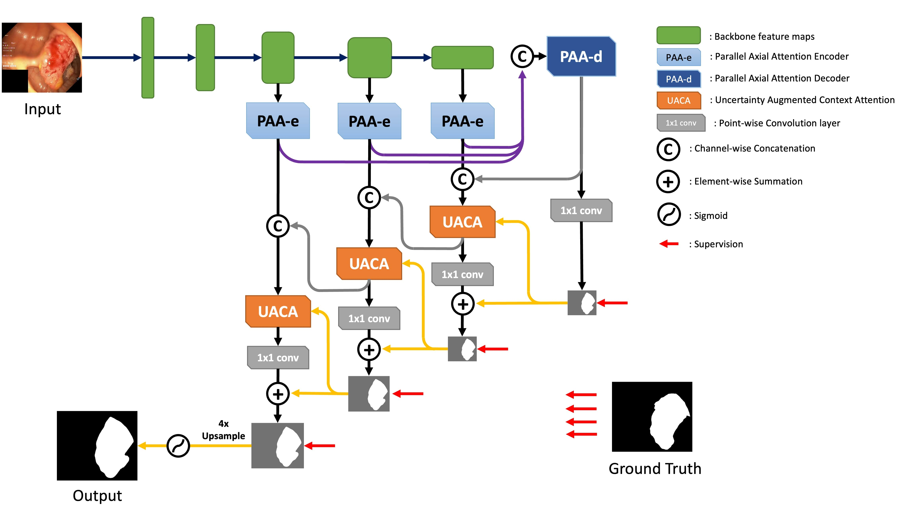
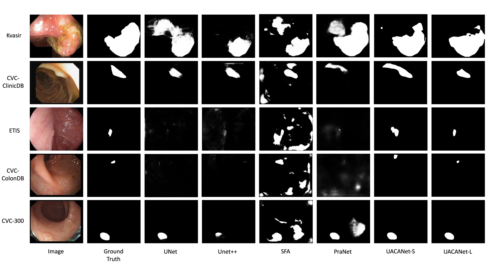

# UACANet: Uncertainty Augmented Context Attention for Polyp Segmentation

[](https://paperswithcode.com/sota/medical-image-segmentation-on-cvc-colondb?p=uacanet-uncertainty-augmented-context)

[](https://paperswithcode.com/sota/medical-image-segmentation-on-etis?p=uacanet-uncertainty-augmented-context)

[](https://paperswithcode.com/sota/medical-image-segmentation-on-kvasir-seg?p=uacanet-uncertainty-augmented-context)

[](https://paperswithcode.com/sota/medical-image-segmentation-on-cvc-clinicdb?p=uacanet-uncertainty-augmented-context)

Official pytorch implementation of [UACANet: Uncertainty Augmented Context Attention for Polyp Segmentation](https://arxiv.org/abs/2107.02368)  
To appear in the Proceedings of the 29th ACM International Conference on Multimedia (ACM MM '21)



## Abstract

We propose Uncertainty Augmented Context Attention network (UACANet) for polyp segmentation which consider a uncertain area of the saliency map. We construct a modified version of U-Net shape network with additional encoder and decoder and compute a saliency map in each bottom-up stream prediction module and propagate to the next prediction module. In each prediction module, previously predicted saliency map is utilized to compute foreground, background and uncertain area map and we aggregate the feature map with three area maps for each representation. Then we compute the relation between each representation and each pixel in the feature map. We conduct experiments on five popular polyp segmentation benchmarks, Kvasir, CVC-ClinicDB, ETIS, CVC-ColonDB and CVC-300, and achieve state-of-the-art performance. Especially, we achieve 76.6% mean Dice on ETIS dataset which is 13.8% improvement compared to the previous state-of-the-art method.

## 0. Automatic Installation
  + (21.10.08 added) by simply using `install.sh`, you can download and locate train/test datasets, backbone checkpoints, pretrained checkpoints and pre-computed results, and automatically create conda environment named `uacanet`. If you find error using our script, please create environment and prepare datasets manually.  

## 1. Create environment
  + Create conda environment with following command `conda create -n uacanet python=3.7`
  + Activate environment with following command `conda activate uacanet`
  + Install requirements with following command `pip install -r requirements.txt`
  
## 2. Prepare datasets
  + Download dataset from following [URL](https://drive.google.com/file/d/17Cs2JhKOKwt4usiAYJVJMnXfyZWySn3s/view?usp=sharing)
  + Move folder `data` to the repository.
  + Folder should be ordered as follows,
```
|-- configs
|-- data
|   |-- TestDataset
|   |   |-- CVC-300
|   |   |   |-- images
|   |   |   `-- masks
|   |   |-- CVC-ClinicDB
|   |   |   |-- images
|   |   |   `-- masks
|   |   |-- CVC-ColonDB
|   |   |   |-- images
|   |   |   `-- masks
|   |   |-- ETIS-LaribPolypDB
|   |   |   |-- images
|   |   |   `-- masks
|   |   `-- Kvasir
|   |       |-- images
|   |       `-- masks
|   `-- TrainDataset
|       |-- images
|       `-- masks
|-- lib
|   |-- backbones
|   |-- losses
|   `-- modules
├── LICENSE
├── README.md
├── requirements.txt
├── results
│   ├── result_CVC-300.csv
│   ├── result_CVC-ClinicDB.csv
│   ├── result_CVC-ColonDB.csv
│   ├── result_ETIS-LaribPolypDB.csv
│   └── result_Kvasir.csv
├── run
│   ├── __init__.py
│   ├── Eval.py
│   ├── Inference.py
│   ├── Test.py
│   └── Train.py
├── snapshots
│   ├── UACANet-L
│   │   ├── CVC-300
│   │   ├── CVC-ClinicDB
│   │   ├── CVC-ColonDB
│   │   ├── ETIS-LaribPolypDB
│   │   ├── Kvasir
│   │   └── latest.pth
│   └── UACANet-S
│       ├── CVC-300
│       ├── CVC-ClinicDB
│       ├── CVC-ColonDB
│       ├── ETIS-LaribPolypDB
│       ├── Kvasir
│       └── latest.pth
└── utils
    ├── custom_transforms.py
    ├── dataloader.py
    ├── eval_functions.py
    ├── __pycache__
    └── utils.py
```

## 3. Train & Evaluate
  + You can train with `CUDA_VISIBLE_DEVICES=0 python run/Train.py --config configs/UACANet-L.yaml --verbose --debug`
  + (21.10.08 added) You can also train your model with multiple GPUs. `CUDA_VISIBLE_DEVICES=0,1 python -m torch.distributed.launch --nproc_per_node 2 --master_port=$RANDOM run/Train.py --config configs/UACANet-L.yaml --verbose --debug`
  + You can generate prediction for test dataset with `python run/Test.py --config configs/UACANet-L.yaml --verbose`
  + You can evaluate generated prediction with `python run/Eval.py --config configs/UACANet-L.yaml --verbose`
  + You can also use `CUDA_VISIBLE_DEVICES=0 python Expr.py --config configs/UACANet-L.yaml --verbose --debug` to train, generate prediction and evaluation in single command
  + (21.10.08 added) You can also use `python Exprs.py --config configs/UACANet-L.yaml --exprs 8 --devices 0,1 --verbose --debug` to train, generate prediction and evaluation for multiple times for single configuration in single command. Note that it works on tmux environment only, so use this on tmux console.
  
  + (optional) Download our best result checkpoint and pre-computed maps from following [URL](https://drive.google.com/file/d/1C5ag5X_gKR1IHW6fVAHdMggu7ilU1XbC/view?usp=sharing) for UACANet-L and UACANet-S.

## 4. Experimental Results
  + UACANet-S
  ```
  dataset              meanDic    meanIoU    wFm     Sm    meanEm    mae    maxEm    maxDic    maxIoU    meanSen    maxSen    meanSpe    maxSpe
-----------------  ---------  ---------  -----  -----  --------  -----  -------  --------  --------  ---------  --------  ---------  --------
CVC-300                0.902      0.837  0.886  0.934     0.974  0.006    0.976     0.906     0.840      0.959     1.000      0.992     0.995
CVC-ClinicDB           0.916      0.870  0.917  0.940     0.965  0.008    0.968     0.919     0.873      0.942     1.000      0.991     0.995
Kvasir                 0.905      0.852  0.897  0.914     0.948  0.026    0.951     0.908     0.855      0.911     1.000      0.976     0.979
CVC-ColonDB            0.783      0.704  0.772  0.848     0.894  0.034    0.897     0.786     0.706      0.801     1.000      0.958     0.962
ETIS-LaribPolypDB      0.694      0.615  0.650  0.815     0.848  0.023    0.851     0.696     0.618      0.833     1.000      0.887     0.891
  ```
  + UACANet-L
  ```
  dataset              meanDic    meanIoU    wFm     Sm    meanEm    mae    maxEm    maxDic    maxIoU    meanSen    maxSen    meanSpe    maxSpe
-----------------  ---------  ---------  -----  -----  --------  -----  -------  --------  --------  ---------  --------  ---------  --------
CVC-300                0.910      0.849  0.901  0.937     0.977  0.005    0.980     0.913     0.853      0.940     1.000      0.993     0.997
CVC-ClinicDB           0.926      0.880  0.928  0.943     0.974  0.006    0.976     0.929     0.883      0.943     1.000      0.992     0.996
Kvasir                 0.912      0.859  0.902  0.917     0.955  0.025    0.958     0.915     0.862      0.923     1.000      0.983     0.987
CVC-ColonDB            0.751      0.678  0.746  0.835     0.875  0.039    0.878     0.753     0.680      0.754     1.000      0.953     0.957
ETIS-LaribPolypDB      0.766      0.689  0.740  0.859     0.903  0.012    0.905     0.769     0.691      0.813     1.000      0.932     0.936
  ```
  + Qualitative Results 



  
## 5. Citation
```
@misc{kim2021uacanet,
    title={UACANet: Uncertainty Augmented Context Attention for Polyp Segmentation},
    author={Taehun Kim and Hyemin Lee and Daijin Kim},
    year={2021},
    eprint={2107.02368},
    archivePrefix={arXiv},
    primaryClass={cs.CV}
}
```
  + Conference version will be added soon.

## 6. Acknowledgement
 + Basic training strategy, datasets and evaluation methods are brought from [PraNet](https://github.com/DengPingFan/PraNet). Especially for the evalutation, we made Python version based on PraNet's MatLab version and verified on various samples. Thanks for the great work!
 + This work was supported by Institute of Information & communications Technology Planning & Evaluation(IITP) grant funded by the Korea government(MSIT) (No.B0101-15-0266, Development of High Performance Visual BigData Discovery Platform for Large-Scale Realtime Data Analysis), (No.2017-0-00897, Development of Object Detection and Recognition for Intelligent Vehicles) and (No.2018-0-01290, Development of an Open Dataset and Cognitive Processing Technology for the Recognition of Features Derived From Unstructured Human Motions Used in Self-driving Cars)
